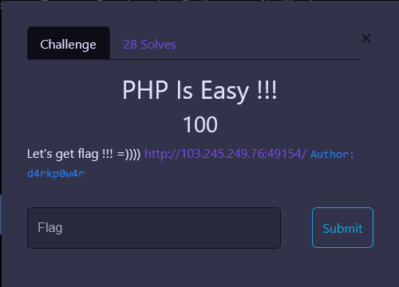
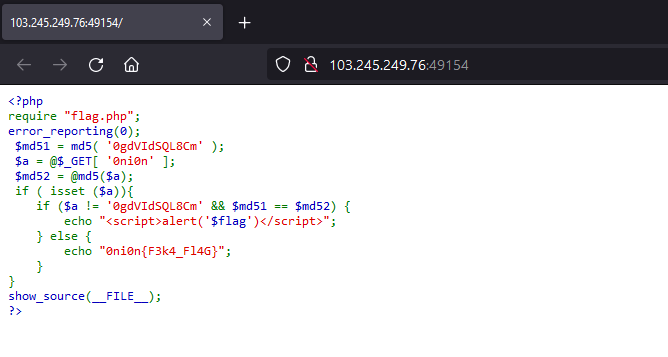
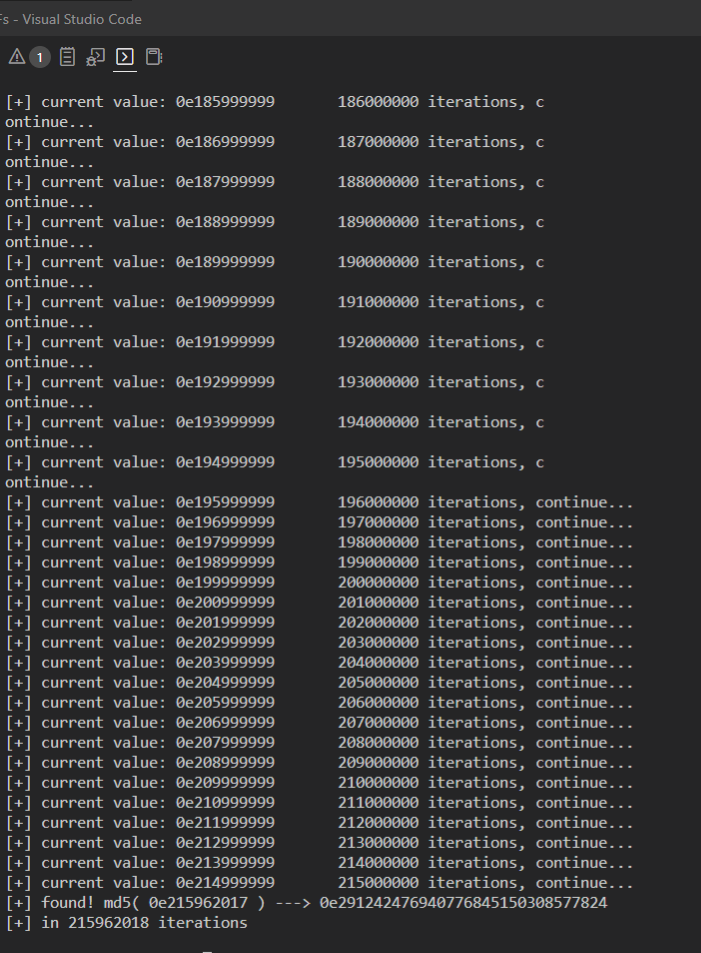
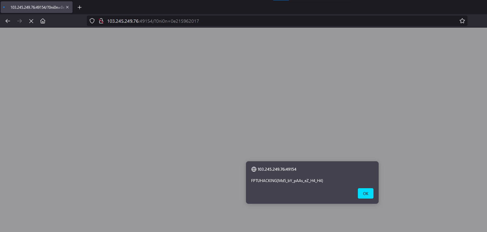

# PHP Is Easy !!!

**Category:** Web Exploitation

---
## 1. Analyze
The challenge provided a simple PHP source:

So, to get the `flag`, we need to pass in a query parameter `0ni0n`, which can not be `"0gdVIdSQL8Cm"` and the MD5 hash of it is equal to itself.

The most noticeable thing are the comparisons. They are using `"=="` ("loose" comparison mode) instead of `"==="` ("strict" comparison mode). Now, we know that this can be exploited using [PHP type juggling bugs](https://owasp.org/www-pdf-archive/PHPMagicTricks-TypeJuggling.pdf).

## 2. Solution

The easiest way to break this thing is to provide a number starting with `0e` ( also used in [Piece Of Cake](../Piece%20Of%20Cake/Piece%20Of%20Cake.md) ), which MD5 hash begins with `0e` as well and contains only numbers after it.

So, I used a [python script](./media/bruteforce.py) to find the exact entry. And after few minutes of bruteforcing, I found `"0e215962017"`.

Finally, get the `flag` using the result we got earlier.

The flag: `FPTUHACKING{Md5_bY_pAAs_eZ_H4_H4}`
