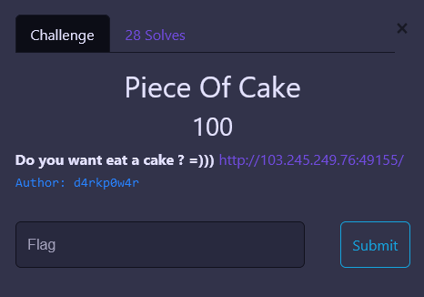
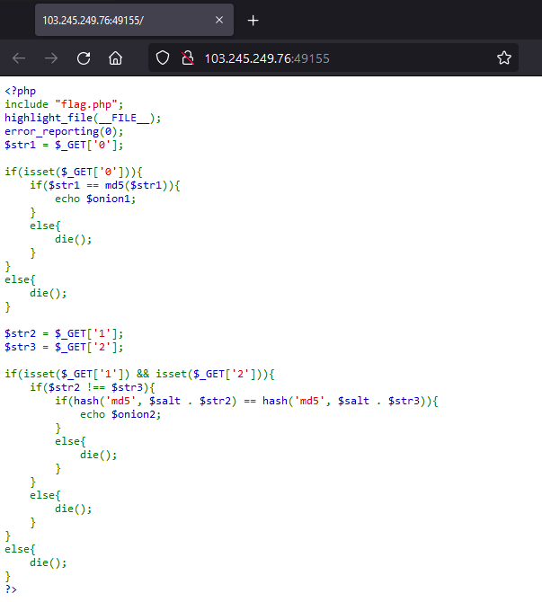
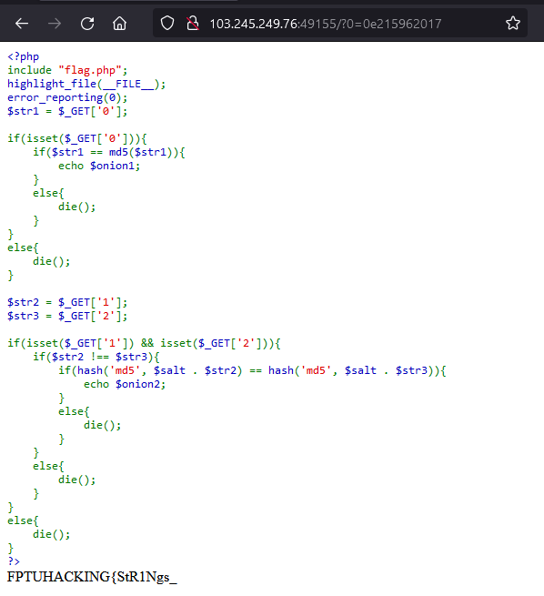
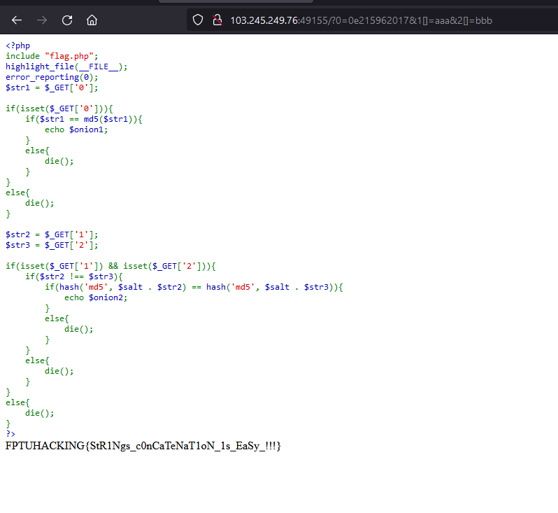

# Piece Of Cake


**Category:** Web Exploitation

---
## 1. Analyze
The challenge provided a PHP source:


Reading the source code, we can see that there're seperately 2 part. The `flag` should appear after solving `$onion1` and `$onion2`.

### Part 1:
```PHP
$str1 = $_GET['0']; 

if(isset($_GET['0'])){ 
    if($str1 == md5($str1)){ 
        echo $onion1; 
    } 
    else{ 
        die(); 
    } 
} 
else{ 
    die();    
}  
```

The idea of the first part is pretty much similar to the [PHP Is Easy !!!](../PHP%20Is%20Easy%20!!!/PHP%20Is%20Easy%20!!!.md) challenge since it also have [PHP type juggling bugs](https://owasp.org/www-pdf-archive/PHPMagicTricks-TypeJuggling.pdf). So I decided to use the same payload in that challenge which is `0e215962017`.


Here's what we got:



Seems like we're on the right path.

### Part 2:
```PHP
$str2 = $_GET['1']; 
$str3 = $_GET['2']; 

if(isset($_GET['1']) && isset($_GET['2'])){ 
    if($str2 !== $str3){ 
        if(hash('md5', $salt . $str2) == hash('md5', $salt . $str3)){ 
            echo $onion2; 
        } 
        else{ 
            die(); 
        } 
    } 
    else{ 
        die(); 
    } 
} 
else{ 
    die();    
}  
```
On the second part, it required 2 query parameters `1` and `2`. These two must be not equal to each other. Also, the `MD5` hash of the concatenation of `$salt` and the parameters must equal to each other.
It's quite tough to find both hash that matchs those conditions by bruteforcing. However, there is another way to make this work.

In PHP when we concatenate a string with an array like this:
```PHP
$str = "aaa";
$arr[] = "bbb";

echo ($str . $arr);
```
It will print out `"aaaArray"` doesn't matter what the value of `$arr` is. With this, we can bypass the filter using the following query: 
```
http://103.245.249.76:49155/?0=0e215962017&1[]=aaa&2[]=bbb
```
And finally, I we got the flag: `FPTUHACKING{StR1Ngs_c0nCaTeNaT1oN_1s_EaSy_!!!}`


